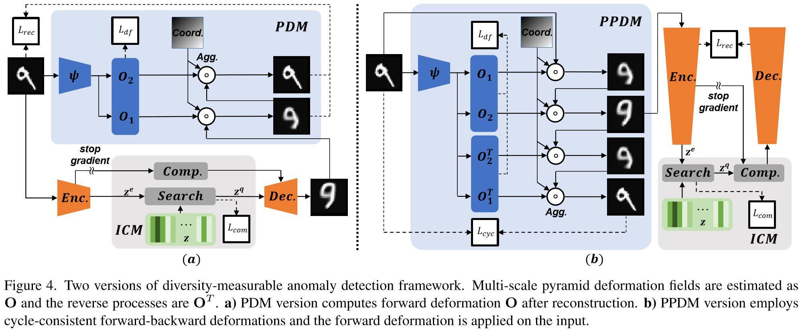
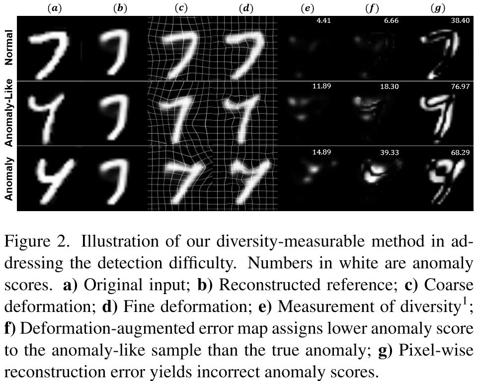
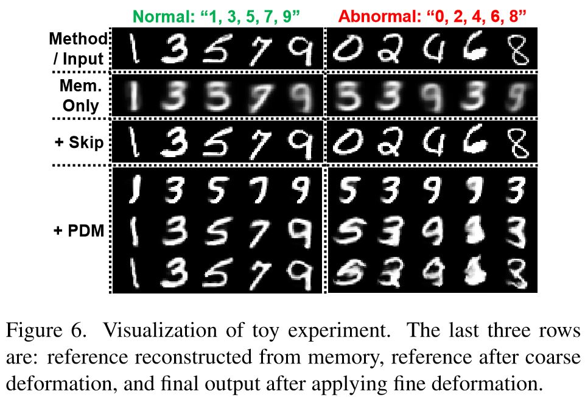

# Diversity-Measurable Anomaly Detection
- This repo is the **official code** for "Diversity-Measurable Anomaly Detection", CVPR 2023 by Wenrui Liu, Hong Chang, Bingpeng Ma, Shiguang Shan, Xilin Chen.
- Also check the following link [DMSSD](https://openreview.net/forum?id=1IIiQnLRe8) for the **imporvement** of DMAD and utilizing diversity-measurable representation for **OoD detection**! 

<div align="center">
     
</div>

<div align="center">
    
</div>

## Requirements

- Linux or Win
- Python 3.6
- PyTorch 1.9.0
- TorchVision 0.10.0
- Numpy 1.19.5
- OpenCV 3.4.2
- Scipy 1.5.4
- PIL 8.1.0


## Datasets
If you need to download a dataset, these resources may be helpful:
* USCD Ped2 [[Dataset](http://www.svcl.ucsd.edu/projects/anomaly/UCSD_Anomaly_Dataset.tar.gz)]
* CUHK Avenue [[Dataset](http://www.cse.cuhk.edu.hk/leojia/projects/detectabnormal/Avenue_Dataset.zip)]
* ShanghaiTech [[Dataset](https://github.com/StevenLiuWen/ano_pred_cvpr2018)]
* MVTec AD [[Dataset](https://www.mvtec.com/company/research/datasets/mvtec-ad)]

Then you need to move the downloaded datasets, like ``./dataset/ped2/'' for PDM and specify the corresponding path for PPDM.


## Toy Experiment
Download VQ-CVAE-based DMAD-PDM from [GoogleDrive](https://drive.google.com/file/d/1llmszdgp7VvKre-SQDw5GJN3TKs4-IJK/view?usp=sharing) or design your custom dataset with code in DMAD-Toy
Then chech the arguments parser and run:
```bash
cd DMAD-Toy
python main.py
```


## Training & Testing
### Pre-Processed Files
The master branch does not contain pre-processing files (>25MB, e.g. background template for ShanghaiTech) and you need to download them at:
[BaiduPan](https://pan.baidu.com/s/1n9ko5szFRjdYxHGbBK0TUw) (Password:dmad) or
[GoogleDrive](https://drive.google.com/drive/folders/1PlRZmTFEQ7_CsrCLP9YI83rvWuAID5DF?usp=sharing)

All files are located with the same path, you just need to download them to the **Corresponding Folder** and **Unzip** them.


### Commands
To train or test PDM version DMAD framework, just run:
```bash
cd DMAD-PDM
python [[Train], [Evaluate]]_[[ped2], [avenue], [shanghai]].py
<*optional> python process_avenue.py # to remove static anomalies, e.g. bag and a sitting person on the left side of the screen in dir_1 and dir_2
```

To train or test PPDM version DMAD framework, just run:
```bash
cd DMAD-PPDM
python [[Train], [Evaluate]]_mvtec.py
```

### Pretrained Models
We also provide four model checkpoints to reproduce the performance report in the papar at:
[BaiduPan](https://pan.baidu.com/s/1n9ko5szFRjdYxHGbBK0TUw) (Password:dmad) or
[GoogleDrive](https://drive.google.com/drive/folders/1PlRZmTFEQ7_CsrCLP9YI83rvWuAID5DF?usp=sharing)


### Limitation & Improvement
We mainly focuses on the diversity modeling and measurement framework, where geometrical diversity is just one of common pattern in
anomaly detection. However, as for anomaly with other kind of diversities, e.g. colors,
the **geometric-specific diversity** measurement may not be positively correlated to anomaly severity.
Besides, the training of PDM version may be unstable under certain parameters. 

Our solution about **stable diversity-agnostic** modeling approach will be linked to this repo after relevant paper is accepted.


## Acknowledgments
The architecture for PPDM version is based on the implementation of 
[RD](https://github.com/hq-deng/RD4AD).
VQ-Layer and the architecture for toy experiment on MNIST is based on the implementation of 
[VQ-VAE](https://github.com/AntixK/PyTorch-VAE).
We also thank the authors of [MNAD](https://github.com/cvlab-yonsei/MNAD) 
for the framework of loading data and models applied to surveillance videos.


## Citation
If you find this code useful, please consider citing our paper:
```
@inproceedings{liu2023dmad,
  title={Diversity-Measurable Anomaly Detection},
  author={Wenrui Liu and Hong Chang and Bingpeng Ma and Shiguang Shan and Xilin Chen},
  booktitle={Proceedings of the IEEE/CVF Conference on Computer Vision and Pattern Recognition (CVPR)},
  month={June},
  year={2023},
  pages={12147-12156}
}
```
